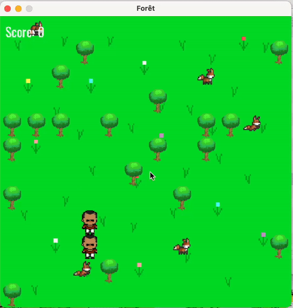

# Jeu_SDL2_C
This is an interactive forest simulation game implemented in C using the Simple DirectMedia Layer (SDL) library. The game, titled "Forêt," challenges players to navigate a forest landscape filled with obstacles, animals, and saviors while trying to save animals in need. 

# Forest Simulation Game

## Overview

The **Forest Simulation Game** is a C-based simulation of a scenario where saviors attempt to rescue animals in a forest filled with obstacles. The simulation demonstrates an example of agent-based behavior and decision-making in a game-like environment. 

## Prerequisites

Before running the Forest Simulation Game, ensure that you have the following installed:

- C compiler (e.g., GCC)
- SDL2 library for graphics and window management
- SDL2_image library for image asset loading
- SDL2_ttf library for text rendering

## Getting Started

1. **Clone the Repository**: Clone this repository to your local machine.

    ```shell
    git clone https://github.com/yourusername/forest-simulation.git
    ```

2. **Compile the Program**: Use your C compiler to compile the program.

    ```shell
    gcc -o main.c -lSDL2 -lSDL2_image -lSDL2_ttf -lm
    ```

3. **Run the Program**: Execute the compiled binary.

    ```shell
    ./a.out
    ```

## How to Play

- In the game, you control saviors whose mission is to rescue animals in a forest full of obstacles.
- Your goal is to rescue all the animals and bring them to a safe location within the forest.
- Control the saviors' movement using a simple AI system.
- The game ends when all animals are rescued or when the saviors encounter certain obstacles.

## Game Rules

- The forest grid contains obstacles, animals, and saviors.
- Saviors can move in different directions to reach animals and perform rescues.
- Animals may exhibit different behavior patterns, adding complexity to the rescue missions.
- The game follows a turn-based system, with saviors and animals taking alternating actions.

## Screenshots




You can list the contributors to your project here, along with their contact information.

## License

This project is open-source and available to use,


Key Features:

-Simulation Environment: The game presents a forest environment with dynamically generated obstacles, animals, and saviors.
-Obstacle Challenges: Players must navigate around trees and other obstacles to reach animals in distress.
-Animal Interaction: The game includes various animal characters and requires players to save them from harm.
-Savior Control: Players control saviors' movements and make decisions to save animals efficiently.
-Rule-Based Logic: The game uses rule-based logic to determine savior movements based on the current situation.
-Interactive Gameplay: Players can interact with the game through mouse clicks and decision-making.
-Start Screen: The game features a start screen to initiate gameplay.
-Game Over: When all animals have been rescued or the game objectives are met, a "Game Over" screen is displayed.

